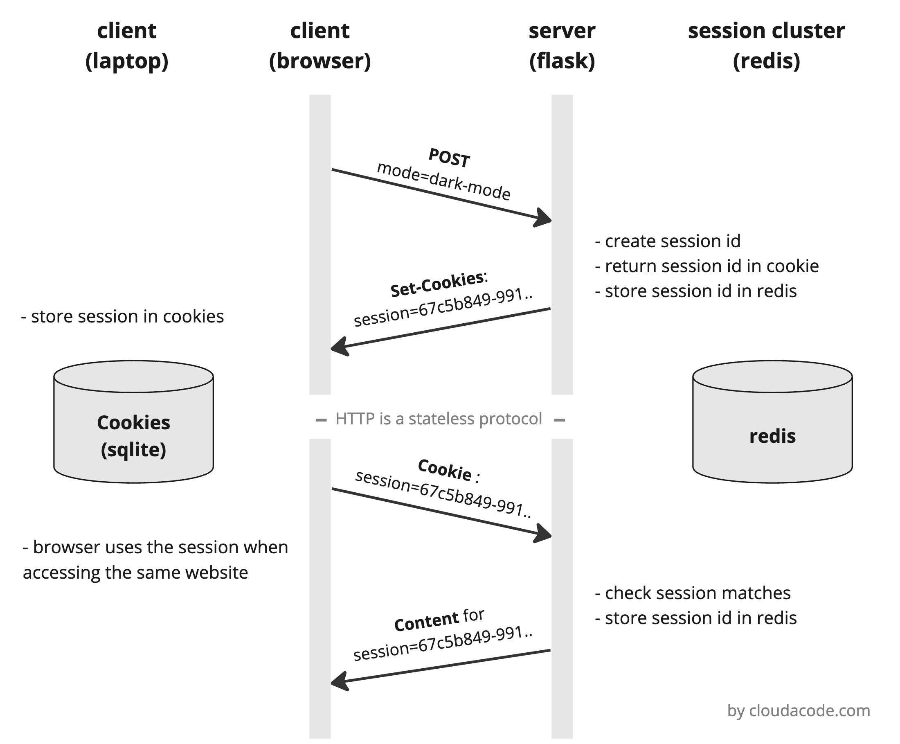

# Dark/Light mode feature with a session from scratch
This example will walk you through setting up a `Dark/Light mode switching` webapp with Redis as a session storage. You will understand the basic knowledge about manipulating sessions on [HTTP a stateless protocol](https://en.wikipedia.org/wiki/Hypertext_Transfer_Protocol#HTTP_application_session).

## Architecture


## Demo

[click](https://youtu.be/cOl2VFvpglY) to see the full demo

## Getting Started

### Setup environment
```
python3 -m venv .venv
source .venv/bin/activate
pip install -r requirements.txt
```

### Setup Redis (local)
```
docker network create my-net
docker run -p 6379:6379 --net my-net --name my-redis -d redis:latest
docker run -it --net my-net --rm redis redis-cli -h my-redis
```

### Run Flask Webapp (local)
```
# (local) run flask server
python app.py
```

### Verify the logic (Swtiching mode, Session)

- Open [http://127.0.0.1:8080](http://127.0.0.1:8080) on your browser
- Click the button to switch dark/light mode
- Check the session data on Redis

    Expected output>
    ```bash
    $ docker exec -it my-redis redis-cli
    127.0.0.1:6379>
    127.0.0.1:6379> KEYS *
    1) "session:bbbb2cd1-0ce6-48f4-b865-b3ac7640b8f7"
    127.0.0.1:6379>
    127.0.0.1:6379> GET session:bbbb2cd1-0ce6-48f4-b865-b3ac7640b8f7
    "\x80\x04\x958\x00\x00\x00\x00\x00\x00\x00}\x94(\x8c\n_permanent\x94\x88\x8c\x05theme\x94\x8c\tdark-mode\x94\x8c\x04mode\x94\x8c\atoggled\x94u."
    127.0.0.1:6379
    ```
- In order to check the `permanent session`, close your browser and open the [http://127.0.0.1:8080](http://127.0.0.1:8080) again
- Verify the mode has been keeping

## Cookies

A cookie is a piece of data from a website that is stored within a web browser that the website can retrieve at a later time. Cookies are used to tell the server that users have returned to a particular website. [Cookies](https://www.trendmicro.com/vinfo/us/security/definition/cookies#:~:text=A%20cookie%20is%20a%20piece,returned%20to%20a%20particular%20website.)


### Where Are the cookies stored?
- On [Windows](https://www.digitalcitizen.life/cookies-location-windows-10/)
    ```
    C:\Users\<YOUR_USER_NAME>\AppData\Local\Google\Chrome\User Data\Default
    ```
- On [MaC](https://www.macbookproslow.com/where-are-cookies-stored-chrome)
    ```
    ~/Library/Application\ Support/Google/Chrome/<YOUR_PROFILE>/Cookies
    ```

You can read the stored Cookies
```bash
$ cp ~/Library/Application\ Support/Google/Chrome/Profile\ 5/Cookies .
$ sqlite3 Cookies

sqlite> .tables
cookies  meta
sqlite> select * from cookies;
...
13312184116422170|127.0.0.1||session||v10l^-v[|kdΏ3-NyєΧ//=jKL'S35n-TU|/|13312184435877382|0|1|13312184135877382|1|1|1|-1|1|8080|0|13312184135877396
13312184165845491|.google.com||SIDCC||v10
...
```

## Reference
- Flask Code: https://www.digitalocean.com/community/tutorials/how-to-use-templates-in-a-flask-application
- Flask Redis Session: https://flask-session.readthedocs.io/en/latest/
